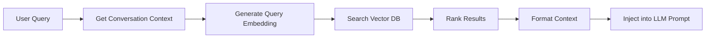

# Qlippy Offline RAG System

This document describes the offline Retrieval-Augmented Generation (RAG) system implemented for Qlippy, enabling local file indexing and intelligent context retrieval for LLM conversations.

## 🏗️ Architecture Overview

The RAG system consists of three main services:

### 1. **FileIndexerService** (`services/file_indexer_service.py`)
- Manages directory scanning and file tracking
- Implements Merkle tree for efficient change detection
- Handles file patterns and exclusions
- Tracks file modifications, additions, and deletions

### 2. **EmbeddingService** (`services/embedding_service.py`)
- Extracts text from various file types (txt, md, pdf, code files)
- Chunks documents intelligently based on file type
- Generates embeddings using local Sentence Transformers
- Stores vectors in Chroma DB with SQLite persistence

### 3. **RAGRetrieverService** (`services/rag_retriever_service.py`)
- Links directories to conversations
- Retrieves relevant chunks for queries
- Formats context for LLM consumption
- Manages background indexing tasks

## 📊 Database Schema

The RAG system extends Qlippy's database with these tables:

- `rag_settings` - Configuration for chunking and retrieval
- `indexed_directories` - Directories being tracked
- `file_index` - File metadata and hashes
- `merkle_tree` - Efficient change detection structure
- `embedding_metadata` - Links files to vector embeddings
- `conversation_rag_context` - Links conversations to directories
- `message_rag_chunks` - Caches retrieved chunks per message

## 🚀 Quick Start

### 1. Install Dependencies

```bash
pip install -r requirements.txt
```

Key dependencies:
- `chromadb` - Vector database
- `sentence-transformers` - Local embeddings
- `pypdf` - PDF text extraction
- `langchain-text-splitters` - Intelligent chunking

### 2. API Endpoints

#### Directory Management

```bash
# Add a directory to index
POST /api/rag/directories
{
    "path": "/path/to/documents",
    "file_patterns": ["*.txt", "*.md", "*.py"],
    "exclude_patterns": ["node_modules", ".git"]
}

# List indexed directories
GET /api/rag/directories

# Remove directory
DELETE /api/rag/directories/{directory_id}
```

#### Indexing

```bash
# Scan for changes
POST /api/rag/directories/{directory_id}/scan

# Index directory (blocking)
POST /api/rag/directories/{directory_id}/index

# Index with progress (WebSocket)
WS /api/rag/directories/{directory_id}/index-stream
```

#### Conversation Context

```bash
# Link directory to conversation
POST /api/rag/conversations/{conversation_id}/context
{
    "directory_id": "uuid-here"
}

# Get conversation contexts
GET /api/rag/conversations/{conversation_id}/context

# Remove context
DELETE /api/rag/conversations/{conversation_id}/context/{directory_id}
```

#### Retrieval

```bash
# Retrieve chunks
POST /api/rag/retrieve
{
    "query": "How does authentication work?",
    "conversation_id": "conv-123",
    "top_k": 5,
    "min_score": 0.3
}

# Get formatted context for LLM
POST /api/rag/retrieve-context
{
    "query": "Explain the database schema",
    "conversation_id": "conv-123"
}
```

## 🔧 Configuration

### RAG Settings

```bash
GET /api/rag/settings
POST /api/rag/settings
{
    "chunk_size": 1000,
    "chunk_overlap": 200,
    "embedding_model": "all-MiniLM-L6-v2",
    "top_k_results": 5,
    "min_relevance_score": 0.3
}
```

### Supported File Types

- **Text**: `.txt`, `.md`, `.markdown`
- **Code**: `.py`, `.js`, `.ts`, `.java`, `.cpp`, `.c`, `.h`
- **Data**: `.json`, `.yaml`, `.yml`, `.csv`, `.tsv`
- **Documents**: `.pdf`

## 🔄 How It Works

### 1. File Indexing Flow


### 2. Retrieval Flow



### 3. Change Detection

The Merkle tree enables efficient change detection:
- Leaf nodes: File path + content hash
- Internal nodes: Hash of child hashes
- Root hash: Represents entire directory state

When a file changes, only affected paths in the tree are recomputed.

## 💻 Integration with LLM

The LLM service automatically includes RAG context when:
1. A conversation has linked directories
2. The query is relevant to indexed content

Example prompt structure:
```
[System Prompt]

Based on the following relevant information from your indexed files:
---
Source: docs/api.md (chunk 3)
The authentication endpoint accepts POST requests...
---
Source: src/auth.py (chunk 1)
def authenticate(username, password):
    # Implementation details...
---

User: How does authentication work in this project? 